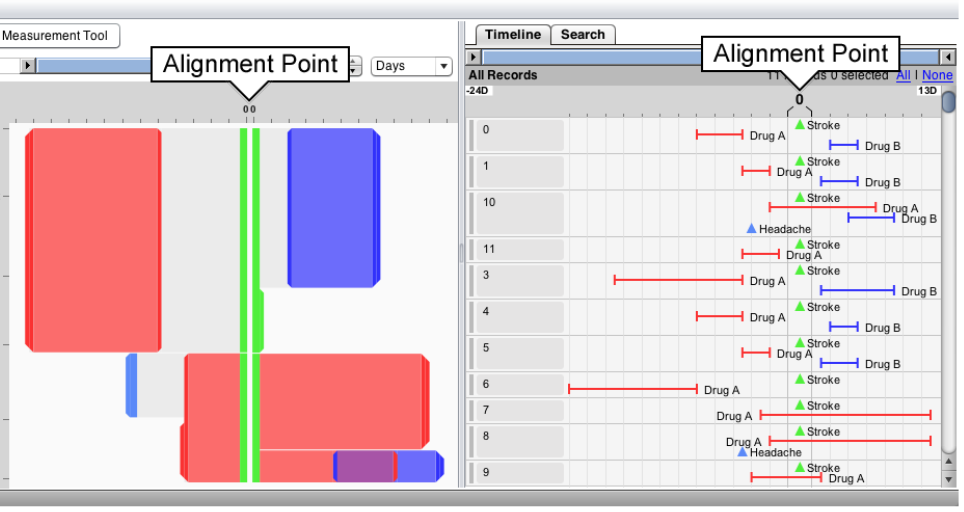
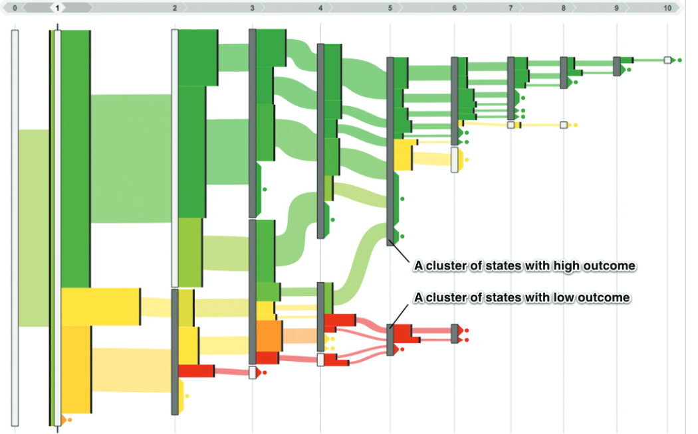
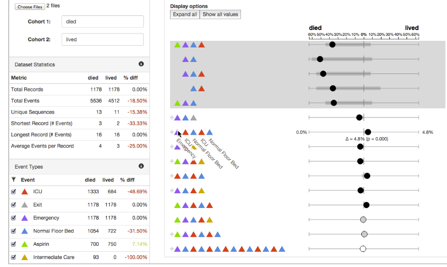
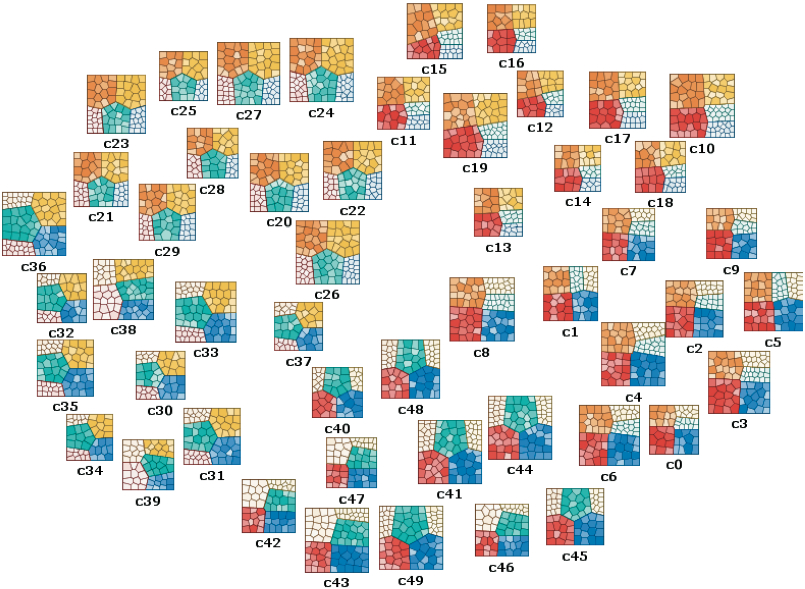

# data-viz-project

# Installing Python packages

Create a new conda environment named `datavis1`:
```
conda update -n base conda
conda env create -f ./base.yaml
conda activate datavis1
```

# Installing MIMIC-APP

* install psql and pgAdmin(the interface)
* create a new database `<database-name>=datavis` with a password `<database-password>` in pgAdmin ().
* create these 3 empty schemas: `cohort1_mimic_core`|`cohort1_mimic_hosp`|`cohort1_mimic_icu`
* Download backup files from [this link](https://drive.switch.ch/index.php/s/PZjZcXRxBeiw1fC)
* Update created schemas by restoring from downloaded backup files ([instructions](https://hevodata.com/learn/pgadmin-backup-database/)).
* Add `lookup` folder ([link](https://drive.switch.ch/index.php/s/iK64Uyq04FabWHA)) to `resources/data1/lookup`

Now, everything is all setup! To run the MimicApp:

```
conda activate datavis1

cd MimicApp
python index.py --dbname <database-name> --psql_pass <database-password>
```

You should be able to see the forwarded port from [http://127.0.0.1:8050](http://127.0.0.1:8050). Select `Visualize a cohort` from top. select 'cohort1' from the dropdown menu and select `load`. DONE!

* you can use `MimicApp/psql2csv.ipynb` to convert database to csv files which will be saved in `MimicApp/datasets/<cohort-name>` (you should modify the absolute PATH in the notebook)

# M1: Data Exploration (April 12)


# Questions

* What questions do you want to answer?
* What is the problem you are trying to solve?
* What decisions are you trying to make?
* What outcomes are you hoping for?
* What story do you want to tell?
* What tasks should the viewer be able to perform?


## Milestone 1 (23rd April, 5pm)

**10% of the final grade**

This is a preliminary milestone to let you set up goals for your final project and assess the feasibility of your ideas.
Please, fill the following sections about your project.

*(max. 2000 characters per section)*

### Dataset

MIMIC-IV is a publicly available dataset containing de-identified electronic health record data from over 2 million ICU patients at Beth Israel Deaconess Medical Center from 2008 to 2019. It includes vital signs, lab results, medications, and clinical notes, and can be used for clinical research and machine learning.

Sepsis is a life-threatening condition caused by the body's response to an infection. It can cause widespread inflammation, organ failure, and septic shock. Early recognition and treatment are crucial for a positive outcome.

We filtered the MIMIC-IV dataset, which has data from over 60,000 ICU patients, to select only those who have at least one ICD code that contains the word "sepsis." This resulted in approximately 8,000 patients being included in our analysis.
### Problematic

<!-- > Frame the general topic of your visualization and the main axis that you want to develop.
> - What am I trying to show with my visualization?
> - Think of an overview for the project, your motivation, and the target audience. -->


Electronic health records (EHRs) pose several challenges related to data management and analysis. One significant challenge is managing multi-modality data, which may include diverse types of data such as imaging, audio, and text data. Time-series and event sequence data is also common in EHRs, but presents challenges in terms of analysis and modeling due to the complexity of temporal relationships. EHRs often contain heterogeneous data, meaning that different data types are collected and stored in different formats, and may be of varying quality. Additionally, EHRs contain data on different disease subtypes, and understanding the unique characteristics and patterns of these subtypes is a complex task. Addressing these challenges requires sophisticated data management techniques, as well as advanced data and visual analytics that can accommodate these diverse data types and structures and provide insights into specific disease subtypes.

We are interested in acquainting students with patient data in electronic health records (EHRs). To achieve this, we will develop several visual analytics tools that can facilitate exploring the dataset by adopting recent advancements in visual analytics technology. These visual tools will provide students with insights into the data and help them understand the underlying patterns and trends.

Based on our literature review, we have identified several components that we plan to develop in our project. These components include:

* A global overview of the entire dataset.
* Interactive subset selection, allowing the user to select a subset of the data by interacting with the overview panel.
* The ability for the user to specify desired outcomes, such as length of stay, specific diseases (using ICD codes), or in-hospital mortality.
* A simple clustering algorithm (e.g. K-means) to show potential patient subgroups. The user should be able to select two subgroups for further analysis.
* A panel utilizing recent "event sequence simplification" algorithms to show differences in medication order for each subgroup.
* A panel to show aggregated trends and temporal patterns in clinical variables, such as laboratory and vital values, for each subgroup.


### Exploratory Data Analysis

> Pre-processing of the data set you chose
> - Show some basic statistics and get insights about the data

### Related work


> - What others have already done with the data?
> - Why is your approach original?
> - What source of inspiration do you take? Visualizations that you found on other websites or magazines (might be unrelated to your data).
> - In case you are using a dataset that you have already explored in another context (ML or ADA course, semester project...), you are required to share the report of that work to outline the differences with the submission for this class.

This database has been used extensively for analysis or for tool testing. [Here](https://www.ncbi.nlm.nih.gov/pmc/articles/PMC7192440/) is a link to a paper that provides a detailed analysis of MIMIC-III.

We used as a base point for our visualizations an interesting paper on the state-of-the-art EHR visualization ([Link here](https://onlinelibrary.wiley.com/doi/full/10.1111/cgf.14424)). Section 4 contains some links to other papers with useful visualizations such as events sequence simplification, clustering or cohort comparison.

Some examples below:









The originality of our project lies in the fact that we want to make the exploration of this dataset understandable and usable by students or inexperienced users with EHR data and to give them useful insights on this dataset.

Hojat Karami already worked on this dataset and the report is available in this repository
